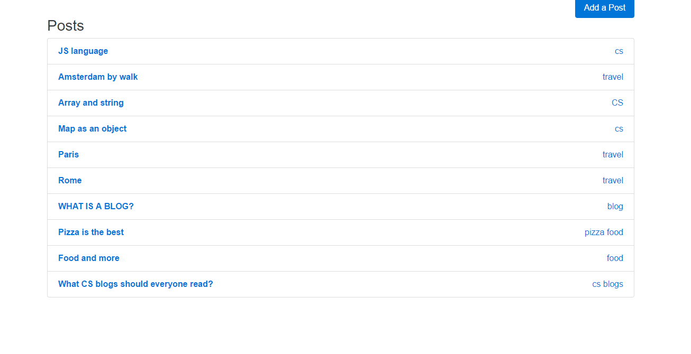
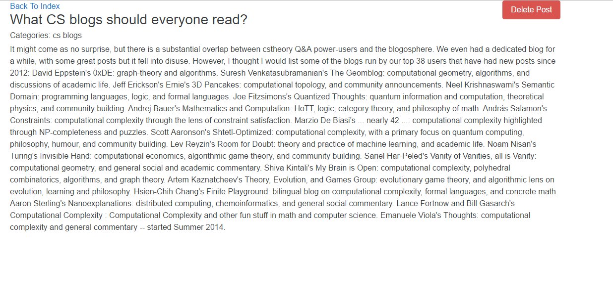
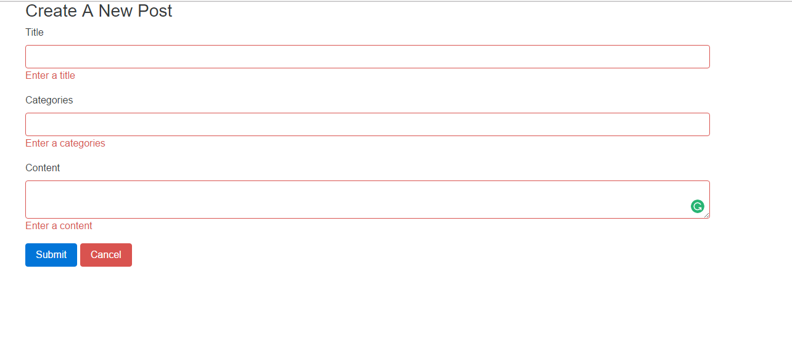

# Blogs-App

####Download#####
Checkout this repo, install dependencies, then start the gulp process with the following:

```
	> git clone https://github.com/ShirH/YouTube-Search-App.git
	> npm install
	> npm start
```

####Screenshots####

All posts page:


Onclick on single post page:


Add new post page:

